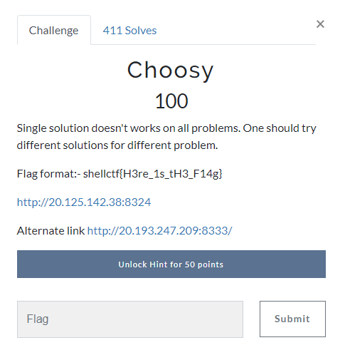
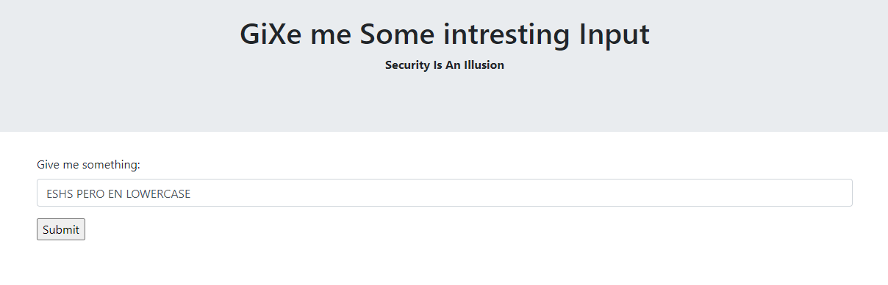
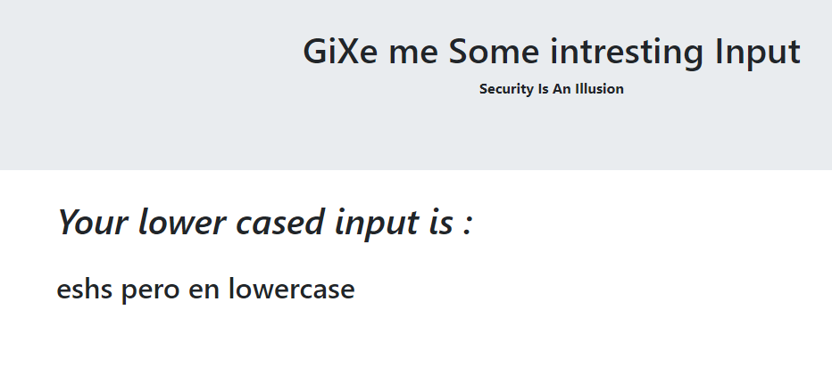
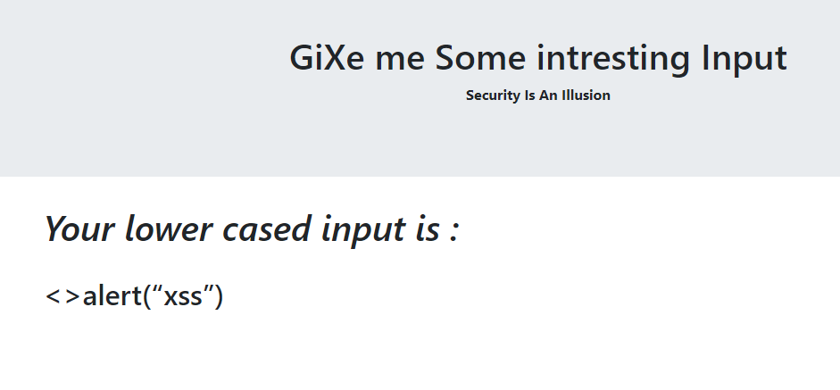
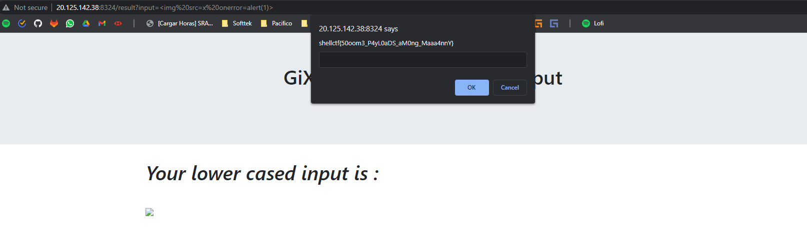

# Extractor

Desafio:

  

Bien, se nos proporciona entonces una URL donde encontramos una pantalla con un input. Este input al parecer sera modificado para estar en lowercase

  


  

Se intento (sin exito) injecciones SQL, Template Injection, ver si podiamos acceder a algun archivo desde un metodo, etc.

Luego intentamos XSS, con `<script>alert(“xss”)</script>`

  

Al parecer el `<script>` es borrado por la pagina para evitar XSS. Probamos entonces con una imagen y generando un error: ``

  

```
Flag: shellctf{50oom3_P4yL0aDS_aM0ng_Maaa4nnY}
```